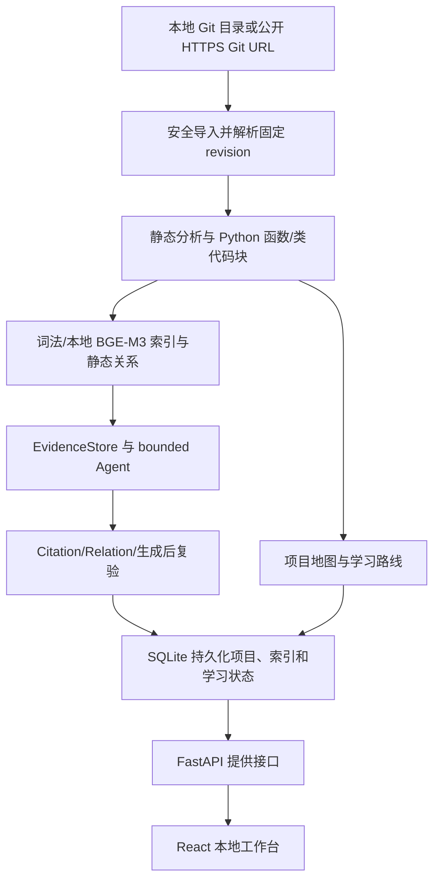

# 源鉴 RepoNoesis

> **Local Product Phase 1: FULL PASS (2026-08-02).** The accepted code baseline
> is `e07bfd16e16ecbb827ab002fb9f11274013b92e3`; Gate A/B/C and the 514-test
> offline backend regression passed. Setup, safe acceptance evidence, and
> limitations are recorded in
> [`docs/v3/LOCAL_PRODUCT_PHASE1.md`](docs/v3/LOCAL_PRODUCT_PHASE1.md).
> Local Product Phase 2 P2.1 provides the persistent project library and
> restart-safe workspace reopening. V3·LP2.2 now adds explicit revision checks,
> persistent idempotent update runs, content-based incremental rebuilds and
> atomic snapshot activation. V3·LP2.3 now adds persistent cross-revision
> learning continuity, deterministic target mapping, conservative mastery
> carry-forward, `needs_review`, and explicit retry. The plan and exact contracts are in
> [`docs/v3/LOCAL_PRODUCT_PHASE2_PLAN.md`](docs/v3/LOCAL_PRODUCT_PHASE2_PLAN.md).

面向编程初学者的 GitHub 开源项目学习 Agent。

源鉴 RepoNoesis 可以输入本地 Git 仓库或公开 HTTPS Git 地址，读取仓库结构与关键源码，进行静态分析、模块划分、核心文件排序，并生成适合初学者阅读的项目地图、学习路线、源码问答和 Markdown 报告。

它不是简单地把 GitHub 链接丢给大模型做摘要，而是先用确定性的工程分析建立可靠上下文，再按教学逻辑组织输出。

## 目录

- [项目定位](#项目定位)
- [核心功能](#核心功能)
- [技术栈](#技术栈)
- [系统架构](#系统架构)
- [快速开始](#快速开始)
- [环境变量](#环境变量)
- [GitHub Token 说明](#github-token-说明)
- [运行方式](#运行方式)
- [API 接口](#api-接口)
- [项目结构](#项目结构)
- [工作原理](#工作原理)
- [测试](#测试)
- [上传 GitHub 注意事项](#上传-github-注意事项)
- [常见问题](#常见问题)
- [当前限制](#当前限制)
- [后续计划](#后续计划)

## 项目定位

很多编程初学者想学习开源项目，但常常会遇到这些问题：

- 不知道应该先看哪个文件。
- 看见复杂目录结构后不知道模块之间的关系。
- 只看 README 不足以理解项目实现。
- 直接问通用 AI 时，回答可能缺少源码依据。
- 大模型一次性总结仓库时容易遗漏入口文件、配置文件和真实模块边界。

GitLearnAgent 的目标是把一个 GitHub 开源仓库转化为一套适合初学者的学习材料：

- 先建立项目全局印象。
- 再理解依赖和启动方式。
- 然后顺着入口文件追踪主流程。
- 接着按模块阅读核心代码。
- 最后通过小任务验证理解。

## 核心功能

| 功能 | 说明 |
| --- | --- |
| GitHub 仓库抓取 | 输入公开仓库 URL，自动读取仓库元信息、目录树和关键文本文件。 |
| 静态分析 | 支持 Python、JavaScript、TypeScript 项目的基础结构分析。 |
| 文件重要性排序 | 根据 README、依赖文件、入口文件、源码目录、导入关系等线索计算核心文件。 |
| 项目地图 | 展示目录树、核心文件、模块职责和模块关系。 |
| 学习路线 | 生成面向初学者的分阶段阅读路径、任务和测验。 |
| 自适应学习状态 | 本地单用户下持久化目标、版本化计划、Evidence 约束任务、学习事件与复习状态。 |
| 源码问答 | 根据已抓取源码进行检索式问答，并返回引用文件和代码片段。 |
| 报告导出 | 生成 Markdown 格式的项目学习报告。 |
| 产品生成模型 | 本地产品问答要求完整的 `openai_compatible` 配置；未配置时导入/离线测试可运行，但产品问答会明确拒绝而不会冒充模型回答。 |
| 可复现实验 | M5 CLI 可在固定真实仓库 revision 上验证数据集并运行隔离的 fake/live provider 对照；默认关闭。 |

## 技术栈

### 后端

- Python 3.12
- FastAPI
- SQLite
- GitHub REST API
- Python `ast` 静态分析
- 规则检索与本地问答兜底

### 前端

- React
- TypeScript
- Vite
- lucide-react
- 原生 CSS

### 开发环境

推荐使用 Anaconda / Miniconda，也可以使用普通 Python 虚拟环境。

## 系统架构



## 快速开始

### 1. 克隆项目

```powershell
git clone https://github.com/anon-0215/GitLearnAgent.git
cd GitLearnAgent
```

### 2. 创建环境

推荐使用 conda：

```powershell
conda env create -f environment.yml
conda activate gitlearnagent
```

如果你的 `conda` 没有配置到环境变量，可以使用 Anaconda Prompt，或者用 Anaconda 的完整路径执行。

### 3. 配置环境变量

复制模板：

```powershell
copy .env.example .env
notepad .env
```

至少建议填写：

```text
GITHUB_TOKEN=你的 GitHub Token
```

### 4. 一键启动

Windows 下可以直接运行：

```powershell
start_all.bat
```

该脚本会打开两个窗口：

- 后端窗口：`http://127.0.0.1:8000`
- 前端窗口：`http://127.0.0.1:5173`

使用项目时两个窗口都不要关闭。

### 5. 打开页面

浏览器访问：

```text
http://127.0.0.1:5173
```

选择“本地目录”并输入干净 Git 工作树的绝对路径，或选择“公开 HTTPS Git”并输入仓库 URL。

```text
D:\Project\my-python-repository
```

## 环境变量

正式后端启动入口会读取根目录下的 `.env` 文件。普通导入 `app.main`
或其他后端模块不会搜索或读取 `.env`，也不会把其中的值写入
`os.environ`。进程环境变量仍优先于 `.env`；测试通过 fixture、显式环境变量
或临时目录中的哨兵 `.env` 提供配置，不依赖工作区真实 `.env`。

| 变量 | 必填 | 说明 |
| --- | --- | --- |
| `LLM_PROVIDER` | 产品必填 | 固定为内部名称 `openai_compatible`。 |
| `LLM_BASE_URL` | 产品必填 | 服务商当前官方文档给出的兼容 API 根地址；代码不写死服务商。 |
| `LLM_API_KEY` | 产品必填 | 只保存在后端 `.env`，不得进入浏览器、数据库、日志或 Git。 |
| `LLM_MODEL` | 产品必填 | 从服务商当前官方文档/控制台确认，不在仓库中硬编码。 |
| `LLM_TIMEOUT_SECONDS` / `LLM_MAX_TOKENS` / `LLM_TEMPERATURE` / `LLM_MAX_RETRIES` | 否 | 产品请求边界；重试次数受服务端上限约束。 |
| `LLM_PLANNER_THINKING` / `LLM_ANSWER_THINKING` | 否 | 可选且相互独立；留空时不发送 `thinking`，仅在服务商明确支持时填写 `enabled` 或 `disabled`。 |
| `EMBEDDING_ENABLED` | 产品必填 | 产品路径设置为 `true`。 |
| `EMBEDDING_PROVIDER` | 产品必填 | 固定为 `local_bge_m3`。 |
| `EMBEDDING_MODEL` | 产品必填 | 本地 BGE-M3 快照绝对路径，或已完整缓存的模型 ID。旧变量 `EMBEDDING_MODEL_NAME_OR_PATH` 只作为兼容别名。 |
| `EMBEDDING_MODEL_REVISION` | 否 | Hugging Face 模型 revision 或 commit。建议生产环境填写固定 commit；本地目录模型不会扫描模型文件内容做指纹。 |
| `EMBEDDING_DEVICE` | 否 | `auto`、`cpu`、`cuda` 或 `cuda:N`。CUDA 不可用时会明确报错。 |
| `EMBEDDING_OFFLINE` | 产品必填 | 设置为 `true`，缺少模型时明确失败且不静默下载。 |
| `EMBEDDING_BATCH_SIZE` | 否 | Embedding 批量编码大小，默认 `8`。 |
| `EMBEDDING_MAX_LENGTH` | 否 | 模型最大文本长度，默认 `8192`，运行时限制在 `16` 到 `8192`。 |
| `EMBEDDING_NORMALIZE` | 否 | 是否保存 L2 归一化向量，默认 `true`。 |
| `EMBEDDING_CACHE_DIR` | 否 | Sentence Transformers 模型缓存目录，默认 `embedding_cache`。 |
| `EMBEDDING_QUERY_PREFIX` | 否 | 查询文本前缀，可为空。 |
| `EMBEDDING_DOCUMENT_PREFIX` | 否 | 代码块文档文本前缀，可为空。 |
| `VITE_API_BASE_URL` | 否 | 前端请求后端的地址，默认 `http://127.0.0.1:8000`。 |

`.env.example` 示例：

```text
LLM_PROVIDER=openai_compatible
LLM_BASE_URL=
LLM_API_KEY=
LLM_MODEL=
EMBEDDING_ENABLED=true
EMBEDDING_PROVIDER=local_bge_m3
EMBEDDING_MODEL=
EMBEDDING_MODEL_REVISION=
EMBEDDING_DEVICE=auto
EMBEDDING_OFFLINE=true
EMBEDDING_BATCH_SIZE=8
EMBEDDING_MAX_LENGTH=8192
EMBEDDING_NORMALIZE=true
EMBEDDING_CACHE_DIR=embedding_cache
EMBEDDING_QUERY_PREFIX=
EMBEDDING_DOCUMENT_PREFIX=
VITE_API_BASE_URL=http://127.0.0.1:8000
```

M5 评测默认不会联网、加载模型或调用付费接口。完整协议见
`docs/v3/M5_EVALUATION_PROTOCOL.md`；从 `backend` 可先执行：

```powershell
python -B -m app.m5 list-modes
python -B -m app.m5 validate --dataset ..\benchmarks\m5\datasets\pilot-v1 --repository-root <只读仓库根目录>
```

真实调用必须额外使用 `--live`，并在本地环境中显式设置相应 `M5_ALLOW_*` gate。不要在命令
或聊天中粘贴 API key。正常 FastAPI 启动与旧 `/ask` 行为不受 M5 CLI 影响。

启用 BGE-M3 前，请先在后端 Python 环境中安装 `sentence-transformers`
和兼容的 PyTorch。系统不会在应用启动时自动加载模型；只有
`EMBEDDING_ENABLED=true` 且分析代码块保存完成后，才会尝试建立
SQLite 向量缓存。真实模型可来自 Hugging Face 名称 `BAAI/bge-m3`，
也可以来自用户配置的本地模型目录。

向量缓存命中会同时校验 code chunk、源码内容哈希、最终 embedding
输入哈希、模型名称、模型 revision、文本格式版本、prefix/max length
等配置身份和 normalized 设置。Hugging Face 模型会优先记录显式配置
的 revision，并在真实加载后尽量读取 resolved commit；如果使用本地
模型目录，当前只记录目录路径标识，不会为了启动速度去哈希数 GB 的
模型文件。

## GitHub Token 说明

GitHub Token 不是大模型 API，也不是付费接口。它相当于访问 GitHub API 时使用的身份凭证。

不使用 token 时，GitHub 会把你的请求当作匿名请求，额度较低，容易出现：

```text
API rate limit exceeded
```

配置 `GITHUB_TOKEN` 后，请求额度会提高，适合反复分析仓库。

注意：

- 不要把 `.env` 上传到 GitHub。
- 不要把 token 发给别人。
- token 必须逐字复制，不能缺字符，不能把下划线 `_` 改成空格。
- 如果看到 `Bad credentials`，说明 token 无效、过期、复制错误或被撤销。

可以访问后端健康检查确认 token 是否被读取：

```text
http://127.0.0.1:8000/api/health
```

返回示例：

```json
{
  "ok": true,
  "llm_available": false,
  "github_token_configured": true,
  "database": "D:\\Project\\RepoNoesis-v3\\backend\\data\\gitlearn.sqlite"
}
```

## 运行方式

### 一键启动

```powershell
start_all.bat
```

### 分别启动后端和前端

后端：

```powershell
backend\run_backend.bat
```

前端：

```powershell
frontend\run_frontend.bat
```

### 手动启动后端

```powershell
cd backend
python -m app.run_server
```

`app.run_server` 是正式后端 bootstrap：先显式加载 `.env`，再读取主机、端口
并让 Uvicorn 导入 `app.main:app`。不要用 `uvicorn app.main:app` 绕过该顺序。
工程边界与证明范围见 [OPS ENV1 记录](docs/v3/OPS_ENV1.md)。

### 手动启动前端

```powershell
cd frontend
npm install
npm run dev
```

## API 接口

后端默认运行在：

```text
http://127.0.0.1:8000
```

| 方法 | 路径 | 说明 |
| --- | --- | --- |
| `GET` | `/api/health` | 健康检查，确认后端、LLM 配置和 GitHub token 状态。 |
| `POST` | `/api/projects/analyze` | 提交本地 Git 目录或公开 HTTPS Git URL，完成产品导入/分析并返回 `project_id`；旧 `repo_url` 请求保持兼容。 |
| `GET` | `/api/workspaces?limit=20&offset=0` | 分页读取不含源码、Evidence、Embedding 或本地路径的项目库摘要。 |
| `GET` | `/api/workspaces/{workspace_id}` | 解析当前可重新打开的持久化 project snapshot；只读且不触发分析、索引或 Provider。 |
| `POST` | `/api/workspaces/{workspace_id}/revision/check` | 用户显式检查当前与可用 revision；不自动启动更新。 |
| `POST` | `/api/workspaces/{workspace_id}/refresh` | 用户确认后创建或复用幂等 update run；客户端不能指定内部 snapshot ID。 |
| `GET` | `/api/workspaces/{workspace_id}/runs/{run_id}` | 读取持久化阶段、计数和安全失败信息。 |
| `POST` | `/api/workspaces/{workspace_id}/runs/{run_id}/retry` | 显式重试可安全恢复的失败 run。 |
| `GET` | `/api/workspaces/{workspace_id}/learning-continuity` | 读取当前 activation 的学习连续性状态与安全计数。 |
| `GET` | `/api/workspaces/{workspace_id}/learning-continuity/{transition_id}` | 读取持久化 transition 详情，不触发模型或分析。 |
| `GET` | `/api/workspaces/{workspace_id}/learning-continuity/{transition_id}/targets` | 读取不含源码/Evidence 正文的 target 影响摘要。 |
| `POST` | `/api/workspaces/{workspace_id}/learning-continuity/{transition_id}/retry` | 显式重试失败的 continuity transition。 |
| `GET` | `/api/projects/{project_id}` | 获取项目概览、技术栈、核心文件和模块摘要。 |
| `GET` | `/api/projects/{project_id}/map` | 获取目录树、模块关系和核心文件列表。 |
| `GET` | `/api/projects/{project_id}/learning-path` | 获取学习路线、任务和测验。 |
| `POST` | `/api/projects/{project_id}/ask` | 对已分析项目进行源码问答，返回答案和引用片段。 |
| `POST/GET` | `/api/projects/{project_id}/learning/goals` | 创建或读取结构化学习目标。 |
| `POST` | `/api/projects/{project_id}/learning/plans` | 创建版本化学习计划。 |
| `GET` | `/api/projects/{project_id}/learning/plans/current` | 读取当前计划和版本。 |
| `GET` | `/api/projects/{project_id}/learning/state` | 读取受限、可重建的学习状态。 |
| `POST` | `/api/projects/{project_id}/learning/tasks` | 创建绑定当前 revision Evidence 和 rubric 的任务。 |
| `POST` | `/api/projects/{project_id}/learning/tasks/{task_id}/attempts` | 提交受限回答并进行结构化评价。 |
| `GET` | `/api/projects/{project_id}/report` | 获取 Markdown 格式分析报告。 |

分析请求示例：

```http
POST /api/projects/analyze
Content-Type: application/json

{
  "source_type": "local",
  "source": "D:\\Project\\my-python-repository"
}
```

问答请求示例：

```http
POST /api/projects/{project_id}/ask
Content-Type: application/json

{
  "question": "项目入口文件在哪里？"
}
```

## 项目结构

```text
GitLearnAgent/
  backend/
    app/
      main.py                 FastAPI 入口与 API 路由
      config.py               .env 配置读取
      database.py             SQLite 存储层
      models.py               仓库文件与快照模型
      services/
        github_client.py      GitHub API 抓取与文件筛选
        analyzer.py           静态分析与模块划分
        ranker.py             文件重要性评分
        learning_agent.py     学习路线生成
        qa_agent.py           源码问答
        llm_client.py         OpenAI 兼容模型客户端
        report.py             Markdown 报告生成
    tests/                    后端单元测试
    requirements.txt          后端依赖
    run_backend.bat           Windows 后端启动脚本

  frontend/
    src/
      App.tsx                 前端主界面
      lib/api.ts              后端 API 调用封装
      types.ts                前端类型定义
      styles.css              页面样式
    package.json              前端依赖与脚本
    run_frontend.bat          Windows 前端启动脚本

  docs/
    project_proposal.md       大创项目申报简稿
    technical_route.md        技术路线说明
    experiment_plan.md        对比实验设计

  samples/
    demo_repositories.md      推荐演示仓库

  .env.example                环境变量模板
  .gitignore                  Git 忽略规则
  environment.yml             conda 环境定义
  start_all.bat               Windows 一键启动脚本
```

## 工作原理

### 1. 仓库导入

Local Product 路径支持读取干净本地 Git 工作树的 tracked files，或把无凭据公开 HTTPS
Git 仓库克隆到受控、被 Git 忽略的运行目录。两种来源都解析固定 commit revision，且不
执行仓库代码、不安装仓库依赖。旧 `repo_url` GitHub API 路径继续作为兼容入口。

schema v10 在 P2.1 schema v9 的独立稳定 workspace 上保存多个不可变 revision snapshot、
持久化 update run 和单一 active pointer。前端项目库可以在后端
重启后按 URL 中的 `workspace` ID 或浏览器最近 workspace ID 重新打开原 project；该流程只
读取 SQLite 和既有 project API，不重新分析、生成 chunk/Embedding、重建 relation、调用
Provider 或写入学习事件。用户可另行显式检查 revision，并确认后启动 P2.2 refresh；更新在
staging snapshot 中完成，验证前旧 active snapshot 始终可用，成功后单事务激活。

P2.2 使用文件内容哈希而非 mtime 区分新增、修改、删除、重命名和未变化文件。chunker 版本
一致时可复制未变化 chunk；Embedding 只有在最终输入、内容、模型/revision、维度、文本格式、
prefix/max length 和 normalize 等完整身份一致且向量校验通过时才复用。relation 在新
`project_id + revision` 内全量重建，避免跨 snapshot 污染。refresh 不复制、修改或重验证旧
Evidence、attempt、evaluation、immutable event 或 mastery。LP2.3 在激活事务中创建持久化
continuity transition，并只用确定性 identity/hash/AST 结构规则映射学习 target：严格
unchanged/unique rename 可派生状态，modified 强制 `needs_review`，deleted/ambiguous/
unmapped/incompatible 不继承。旧历史仍绑定原 project；新 revision 的 continuity event
明确标为系统派生且没有 attempt/evaluation。完整契约见
[`docs/v3/LOCAL_PRODUCT_P2_3_CONTRACT.md`](docs/v3/LOCAL_PRODUCT_P2_3_CONTRACT.md)。

后端会解析 GitHub URL，提取 `owner/repo`，然后通过 GitHub REST API 获取：

- 仓库元信息
- 默认分支
- 递归文件树
- 候选文件 blob 内容

为了避免大仓库等待过久，系统会先对文件路径做优先级排序：

- 优先抓取 README。
- 优先抓取依赖和配置文件。
- 优先抓取入口文件。
- 优先抓取 `src`、`app`、`backend`、`frontend`、`tests` 等目录。
- 跳过 `node_modules`、`dist`、`build`、`.venv`、二进制文件和大文件。
- 普通 Markdown 文档不会大量抓取，只保留 README 等关键说明文件。

当前版本会并发抓取关键候选文件，以降低大仓库分析时间。

### 2. 静态分析

系统目前支持基础分析：

- Python：使用 `ast` 提取 import、函数、类。
- JavaScript / TypeScript：提取 import/export、函数、类和前端入口线索。
- 配置文件：识别 `package.json`、`pyproject.toml`、`requirements.txt` 等。
- 框架识别：根据依赖和源码线索识别 React、Vite、FastAPI、Flask、Django 等。

### 3. 文件重要性评分

系统会根据以下线索给文件打分：

- 是否是 README。
- 是否是依赖或配置文件。
- 是否是入口文件。
- 是否位于源码目录。
- 是否包含框架入口特征。
- import 数量。
- 函数、类、组件等符号数量。

得分靠前的文件会被标记为核心文件。

### 4. 模块划分

系统主要根据目录结构和文件职责聚合模块。例如：

- `docs`
- `project-config`
- `backend`
- `frontend`
- `src`
- `tests`

每个模块会生成职责说明和推荐阅读文件。

### 5. 学习路线生成

兼容学习路线仍按五个阶段生成：

1. 建立项目全局印象。
2. 理解依赖和启动方式。
3. 顺着入口文件追主流程。
4. 分模块阅读核心代码。
5. 完成一个小修改任务。

即使没有配置大模型 API，这部分也可以通过本地规则生成。

M4 另提供正式的结构化学习闭环。它使用 local single-user profile、版本化 plan、
不可变 event 和确定性状态投影；self-report 不会直接变成 mastered，无可用语义 evaluator
时 attempt 明确返回 ungradable。学习记忆不保存完整聊天，也不执行目标仓库代码。

### 6. 源码问答

问答流程不是直接让模型猜答案，而是：

```text
用户问题
→ 本地检索相关文件
→ 提取相关代码片段
→ 生成带引用路径的回答
```

Local Product 的生成式问答要求完整的后端 `openai_compatible` 配置；配置缺失时会明确
拒绝真实产品生成，不能把本地 deterministic fallback 冒充为 Provider 回答。离线测试和
兼容路径仍可显式使用确定性回答。

### 7. 报告生成

报告接口会输出 Markdown，包含：

- 项目基础信息
- 技术栈
- 项目概览
- 核心文件
- 模块地图
- 推荐学习路线
- 大创差异化说明

## 测试

后端测试：

```powershell
cd backend
python -B -m unittest discover tests
```

前端类型检查：

```powershell
cd frontend
node node_modules/typescript/bin/tsc
```

前端生产构建：

```powershell
cd frontend
npm run build
```

V3·LP2.3 在 2026-08-08 的最终离线回归记录为：后端 `Ran 557 tests / OK`；前端
Vitest `9 passed`；TypeScript 与 Vite production build 通过。该记录只使用
临时 fixture、fake repository/fake Embedding 与静态检查，没有运行真实网络、BGE-M3、
Provider、Gate A/B/C、P2 live Gate 或 M5 live pilot。

## 上传 GitHub 注意事项

不要上传这些文件或目录：

```text
.env
backend/.venv/
frontend/node_modules/
frontend/dist/
backend/data/
frontend/.vite-cache/
__pycache__/
```

这些已经写入 `.gitignore`。

可以上传：

```text
.env.example
environment.yml
backend/requirements.txt
frontend/package.json
frontend/package-lock.json
README.md
docs/
samples/
```

`.env.example` 是模板，可以上传；`.env` 是本地密钥配置，不能上传。

## 常见问题

### 1. PowerShell 提示 `conda` 不是命令

说明 Anaconda 没有加入环境变量。解决方式：

- 使用 Anaconda Prompt。
- 或直接运行项目提供的 `.bat` 脚本。
- 或把 Anaconda 添加到 PATH。

### 2. PowerShell 禁止运行 `.ps1`

Windows 默认可能禁止执行 PowerShell 脚本。可以直接运行：

```powershell
backend\run_backend.bat
frontend\run_frontend.bat
```

### 3. 前端显示 `Failed to fetch`

通常是后端没有启动。

请确认：

```text
http://127.0.0.1:8000/api/health
```

可以正常打开。

### 4. GitHub 显示 `API rate limit exceeded`

说明匿名请求额度用完了。

请在 `.env` 中配置：

```text
GITHUB_TOKEN=你的 GitHub Token
```

然后重启后端。

### 5. GitHub 显示 `Bad credentials`

说明 token 无效。常见原因：

- token 复制不完整。
- token 已过期。
- token 被删除或撤销。
- token 中的下划线被改成空格。
- `.env` 中多了引号、空格或注释。

正确写法：

```text
GITHUB_TOKEN=github_pat_xxxxxxxxxxxxxxxxx
```

### 6. 分析大仓库一直等待

大仓库会比小仓库慢。当前版本已经做了核心文件筛选和并发抓取。

一般仓库建议等待 20-60 秒。如果超过 2 分钟，可以：

- 刷新前端页面。
- 重启后端。
- 先用较小仓库测试。

推荐演示仓库见：

```text
samples/demo_repositories.md
```

### 7. 没有配置大模型 API 能运行吗？

可以。

当前项目的核心能力来自 GitHub 抓取、静态分析、文件排序、模块划分和本地规则。大模型 API 是可选增强项，不是必需项。

## 当前限制

- Local Product Phase 1 支持干净的本地 Git 工作树和无凭据公开 HTTPS Git 仓库；不支持
  私有仓库认证、SSH、submodule 或任意远端地址。
- 产品级代码块、关系扩展和真实 Gate 重点支持 Python；JavaScript/TypeScript 仍只是旧的
  轻量结构分析，不具备同等 Evidence/关系保证。
- JS/TS 分析目前是轻量规则，不是完整 TypeScript 编译器级分析。
- Python 支持保守的静态 import/call/reference/definition 关系扩展，但不代表运行时调用图。
- 已支持本地 BGE-M3 与词法/符号/关系检索，但当前真实验收 fixture 很小，未证明任意仓库
  规模和长期性能。
- 大模型增强只支持 OpenAI 兼容接口。
- 项目数据和 M4 学习状态可持久化，前端可通过稳定 workspace ID 重新打开；新 revision
  使用新的不可变 project snapshot，并在完整验证后原子激活。LP2.3 只为严格等价 target
  派生状态，修改、歧义和不兼容目标不会继续宣称 mastered。
- 初始分析仍同步执行；P2.2 update run 持久化阶段和安全失败状态，但没有自动轮询仓库、
  文件监听、多用户调度或任意规模性能保证。
- 暂不执行被分析仓库代码，避免安全风险。

## 后续计划

- Local Product Phase 2 P2.1 项目库/重新打开、V3·LP2.2 revision-aware 增量刷新和
  V3·LP2.3 跨版本学习连续性已完成离线实现；下一步只能单独授权真实本地产品验收或
  OPS 仓库命名治理。详见
  [`docs/v3/LOCAL_PRODUCT_PHASE2_PLAN.md`](docs/v3/LOCAL_PRODUCT_PHASE2_PLAN.md)。
- M5 继续作为独立的可复现实验和对照评测路线；其 live gate 未完成时不得宣称完整通过。
- 完整学习工作台、更大仓库性能、多项目高级组织、更多语言、私有仓库认证和云多用户能力
  均留作 Phase 2 之后的独立评审，不在当前建议中预先承诺。

## 项目价值

GitLearnAgent 的重点不是替代通用 AI，而是探索一种更适合编程初学者的开源项目导读方式。

相比直接问通用 AI，本项目强调：

- 先分析代码结构，再生成解释。
- 回答必须附带源码引用。
- 输出学习路径而不是一次性摘要。
- 可以用模块覆盖率、引用准确率、幻觉率、学习友好度等指标做评测。

这使它更适合作为“大创”项目进行展示、实验和后续扩展。

## License

当前仓库尚未选择开源许可证。正式公开推广前，建议补充 `LICENSE` 文件，例如 MIT License。

